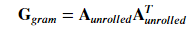

<<<<<<< HEAD
=======
# Neural Style Transfer Streamlit App

This Streamlit app demonstrates neural style transfer, a technique for combining the content of one image with the style of another using a convolutional neural network (CNN). The app allows users to upload a content image and a style image, specify the number of training epochs, and generate a stylized image that blends the content and style.

## Description
This project entails the following:
- Training a VGG-19 model.
- Taking Content image and Style image as input from user through streamlit webapp.
- Adjusting the images according to needs.
- Programming the loss function.
- Generating and displaying the stylized image.
- Giving user option to download the generated image.

## Prerequisites
Before you begin, ensure you have met the following requirements:
- Python 3.7 or higher
- A decent GPU

## Installation
1. Clone the Repository:
```bash
git clone https://github.com/NemesisXVI/Neural_Style_Transfer
cd Neural_Style_Transfer
```
2. Install required Packages:
```bash
pip install -r requirements.txt
```

## Usage
### 1. Run the StreamLit App:

Once in the directory,
Run the file **'app.py'** on the terminal as follows:
```python
streamlit run app.py
```

### 2. Open the app in your browser:

The app will automatically open in your default web browser. If not, navigate to http://localhost:8501.

### 3. Upload Images:

Use the sidebar to upload a content image and a style image.

### 4. Specify Epochs:

Enter the number of epochs for training.

### 5. Generate Image:

Click the "Generate" button to create the stylized image.

### 6. View and Download:

The generated image will be displayed. You can download the image using the "Download Image" button.

## Understanding the VGG19 Model
The VGG-19 model is an extended version of the VGG-16 model, developed by the Visual Geometry Group (VGG) at the University of Oxford. 
It is known for its deep architecture and use of small convolution filters.


We can visualize these layers as shown below:


## Neural Style Transfer

Neural style transfer (NST) is an algorithmic technique used in computer vision and deep learning to apply the artistic style of one image (the "style image") onto the content of another image (the "content image"). The process leverages deep neural networks, typically pre-trained on large datasets, to extract high-level features from both images.

### How it Works

1. **Content Representation**: 
   - The content image provides the basic structure and objects within the final stylized image.
   
2. **Style Representation**: 
   - The style image provides textures, colors, and artistic elements that define the appearance and artistic style of the final image.
   
3. **Feature Extraction**: 
   - A pre-trained convolutional neural network (CNN), such as VGG-19, is used to extract feature maps from multiple layers of both the content and style images.
   
4. **Cost Functions**: 
   - The algorithm calculates two main types of costs:
     - **Content Cost**: Measures how different the content of the generated image is from the content image.
     
     - **Style Cost**: Measures how different the style of the generated image is from the style image, typically computed using the Gram matrix of feature maps.
      where G is the Gram matrix given by
      which signifies the correlation between the channels of a layer.
     - The total style cost is given as:
     -  where the values for  𝜆[𝑙]
  are given in 'STYLE_LAYERS'.
     - **Total Cost:** 
     -  where alpha and beta are hyperparameters that control the relative importance of content and style in the final generated image.
    
   
5. **Optimization**: 
   - Using Adam optimizer, the algorithm adjusts the pixels of a generated image iteratively to minimize both the content and style costs simultaneously.
   
6. **Output**: 
   - The final output is a generated image that preserves the structure of the content image while adopting the artistic style captured from the style image.

## Results
 


**Dawn Sky** 


**Winter Wolf**


**Blue Moon Lake**


**Ancient City**


## Resources
1. [Very Deep Convolutional Networks for large scale Image Recognition](https://acrobat.adobe.com/id/urn:aaid:sc:AP:de451fd0-7190-4bfa-bbb6-53a5e73b171d)
2. [Original Paper on Neural Style Transfer](https://acrobat.adobe.com/id/urn:aaid:sc:AP:e8273893-6068-4d2e-91cb-ef1a90583e23)
3. [Visualizing and Understanding Conv Nets](https://acrobat.adobe.com/id/urn:aaid:sc:AP:d7d4b83c-393a-40fd-bb61-1ef54c79153a)
4. [Visualize VGG model](https://www.youtube.com/watch?v=RNnKtNrsrmg&ab_channel=DenisDmitriev)

## Support
For any queries regarding Neural Style Transfer or its implementation using streamlit, contact me through my socials.
>>>>>>> b3815bb (Initial commit – ImaginAI style‑transfer app)

